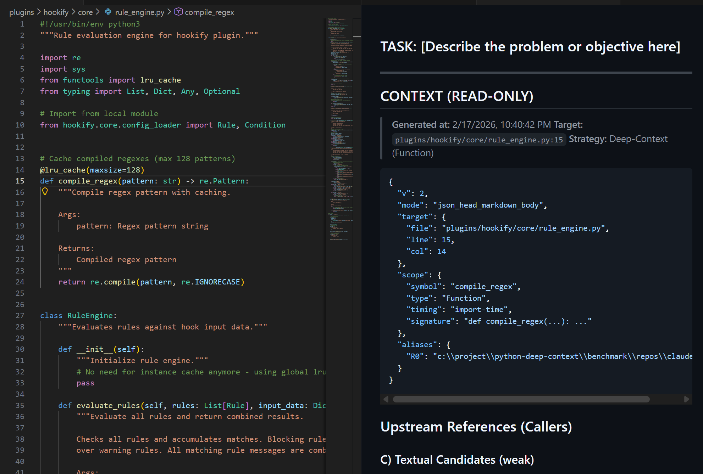
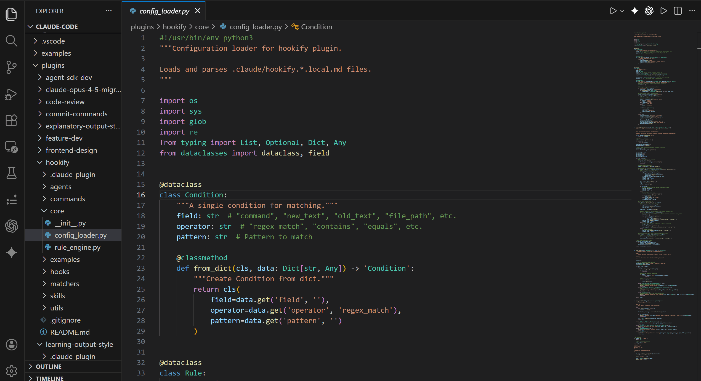
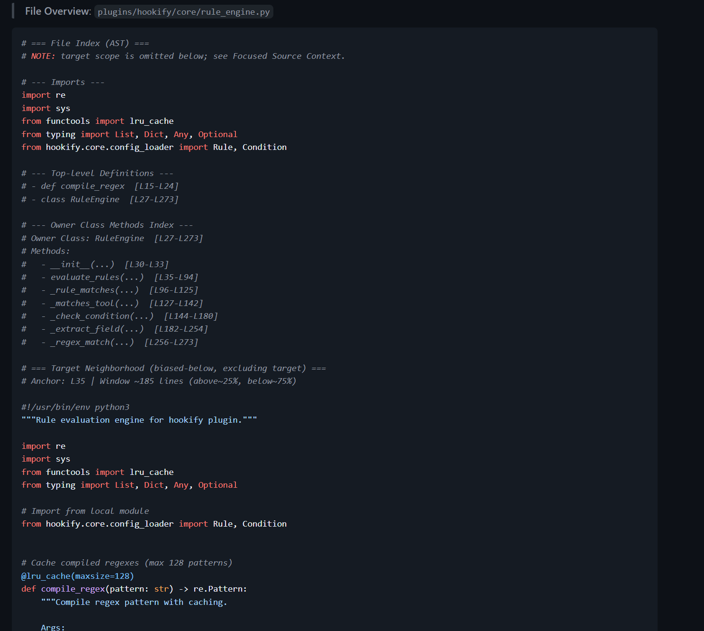
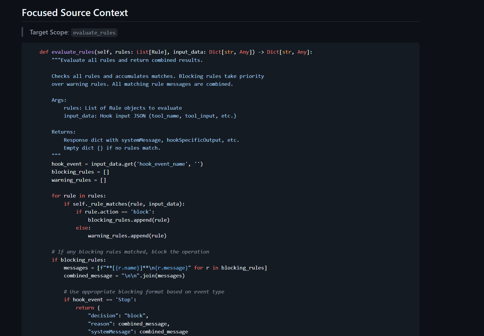
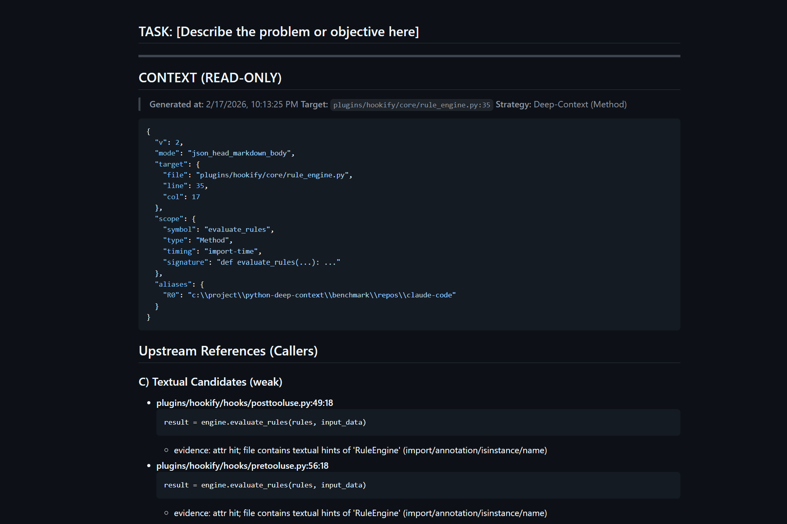

# Python Deep-Context

**Graph-aware context extraction for LLM-assisted coding.**  
Stop sending entire files. Send only what matters.

[](https://marketplace.visualstudio.com/items?itemName=DeepContextLabs.python-deep-context)
[](https://marketplace.visualstudio.com/items?itemName=DeepContextLabs.python-deep-context)
[](https://marketplace.visualstudio.com/items?itemName=DeepContextLabs.python-deep-context)


Python Deep-Context runs a **local Sidecar Engine** and builds a precise dependency slice around your current symbol using a **Hybrid AST + LSP pipeline** — producing a **token-budgeted, high-density report** for modern LLM workflows (Smart RAG, Context Window optimization, refactoring, agentic coding).

🔒 **Security-first / Offline**: analysis runs **100% locally**. **No network required.** Your code never leaves your machine.  
📦 **Bundled engine**: the Sidecar Engine ships as a **standalone binary** — no `pip install` needed.  
✅ **Always-returns**: fast when possible, correct when needed, never empty.

⚡️ **Best companion for:** ChatGPT (Web), Claude.ai, GitHub Copilot Chat, Cursor, Continue, or any custom Agent.



---

## Demo

Short, focused animation showing the end-to-end flow:



---

## Why

LLMs fail when context is:

- **too large** → token waste + noise
- **too small** → missing dependencies + wrong assumptions

Deep-Context solves the “Lost in Context” problem by generating a **high-density, token-budgeted report** around the *current symbol* — with cross-file linking and graceful fallback.

---

## Key Features

- **Smart RAG Slice (Context Window–Optimized)**: Generates a dependency slice for the “symbol at cursor” (function / method / class), optimized for limited Context Windows.
- **Hybrid resolution**: AST fast path + LSP precision + textual fallback
- **Token budgeting**: strict output budget with adaptive degradation
- **Dependency DNA**: resolves library aliases + version fingerprints (lockfiles + runtime)
- **Structural analysis**: highlights I/O, external calls, mutations, and sinks
- **Preview + Copy Markdown**: one-click export for ChatGPT / Claude / Gemini / agents

---

## Quick Start

### 1) Start the Sidecar Engine

Command Palette:

- `Deep-Context: Start Engine`

### 2) Generate a report

Right click in editor:

- `Deep-Context: Generate Report (Here)`
- `Deep-Context: Generate Report (Selection)`

### 3) Open report preview

- `Deep-Context: Open Report Preview`

### 4) Use with an LLM (Copy → Paste)

In the report preview:

- Run `Deep-Context: Copy Last Report Markdown`
- Paste into **ChatGPT / Claude / Gemini** or your agent prompt

**Result:** the model receives the exact local definitions + dependencies needed to solve your task with fewer hallucinations and less token waste.

> Deep-Context generates the *context artifact*; your LLM is the reasoning layer.

---

## Output Examples

### Overview


### Focused Source Context


### Full Report


---

## 📦 Installation

Install directly from the **VS Code Marketplace**.

**Zero pip installs:** the Sidecar Engine is bundled as a **standalone binary** — no `pip install` required.  
**Requires:** Microsoft Python extension (`ms-python.python`) to be active (for language intelligence / LSP integration).

🔒 **Security First (Offline):** Your code never leaves your machine during analysis. The Sidecar Engine runs **100% locally / offline**.

---

## ⚙️ Configuration

Settings are defined under the **`pythonDeepContext.*`** prefix.

| Setting | Default | Description |
| :--- | :--- | :--- |
| `pythonDeepContext.focusMaxLines` | `500` | Max lines to include in the focused source block. |
| `pythonDeepContext.tokenModel` | `"gpt-5.2"` | Tokenizer model used for budgeting (affects truncation). |
| `pythonDeepContext.verbosity` | `"compact"` | Output detail. Use `"debug"` for full dependency graphs. |
| `pythonDeepContext.treeMaxNodes` | `150` | Max nodes displayed in the project structure tree. |
| `pythonDeepContext.scanDepth` | `2` | Max depth for project structure scan. |

> Note: Settings keys must match the extension’s `contributes.configuration` entries in `package.json`.  
> If a setting is not yet implemented in your extension, remove it from the table until it exists.

---

## Technology Inside (Technical Highlights)

Deep-Context is not “autocomplete glue” — it’s a multi-layer analysis engine designed for serious LLM workflows:
**RAG builders, agent engineers, refactoring tooling, prompt engineers, and high-signal code review pipelines.**

| Layer | Component | Function |
|------:|-----------|----------|
| L1 | AST Fast Path | Uses CPython `ast` & LibCST for ms-level scope locating and structural slicing. |
| L2 | Hybrid Linker | Combines LSP resolution (Definition/TypeDefinition/Hover) with ripgrep-style textual verification for precise symbol linking. |
| L3 | Dependency DNA | Scans lockfiles (uv/poetry/pipenv) and probes runtime environments to resolve library versions & aliases. |
| L4 | Structure Analyzer | Detects I/O side effects, control flow skeletons, and variable mutations to model behavior (not just text). |
| L5 | Token Allocator | Uses `tiktoken` to strictly budget output for LLM context windows and adaptive degradation. |

---

## How It Works

### 1) Hybrid Analysis Architecture

A layered strategy that balances **speed**, **accuracy**, and **always-returns** resilience:

- **Layer A — AST Fast Path**  
  Millisecond-level symbol scanning, import binding, scope locating.
- **Layer B — LSP Dynamic Resolution**  
  Uses VS Code language intelligence (Definition / TypeDefinition / Hover) for cross-file precision.
- **Layer C — Textual Fallback**  
  When LSP is slow/unavailable, degrades to high-performance textual search + regex verification.

**Result:** fast when possible, correct when needed, never empty.

### 2) Dependency DNA Fingerprinting

Solves the classic LLM problem: *hallucinated libraries / wrong versions*.

- Parses `requirements.txt`, `pyproject.toml`, lockfiles (uv/poetry/pipenv)
- Runtime probing against the actual interpreter environment
- Alias mapping (e.g., `PIL → Pillow`, `cv2 → opencv-python`)

### 3) Smart Focus Context (Token-Dense)

Not “copy a file” — but **AST-aware slicing**:

- Extracts full function/class definitions (structural, not line-based)
- Collapses noise (large literals, config blobs) while preserving logic skeleton
- One-hop inlining for local helper functions to close the reasoning loop

### 4) Structural Side-Effect Analysis

Helps an LLM understand **behavior**:

- Detects I/O side effects (DB/cache/network/vector DB/LLM calls)
- Captures control-flow skeletons (`if/else`, `try/except`)
- Tracks writes/mutations and important sinks

### 5) Token Budgeting & Adaptive Orchestration

Purpose-built for limited context windows:

- Built-in token counting (`tiktoken`)
- Parallel orchestration of AST/LSP/deps scans
- Priority-based degradation: drop low-value text first, keep core definitions/edges

---

## Commands

| Command | Description |
|--------|-------------|
| Deep-Context: Start Engine | Launch Sidecar Engine |
| Deep-Context: Stop Engine | Stop Sidecar Engine |
| Deep-Context: Generate Report (Here) | Analyze symbol at cursor |
| Deep-Context: Generate Report (Selection) | Analyze current selection |
| Deep-Context: Re-run Last Target | Repeat last analysis |
| Deep-Context: Open Report Preview | Open the report document |
| Deep-Context: Copy Last Report Markdown | Copy report to clipboard |

---

## Troubleshooting

- **Report is empty or missing cross-file links**  
  Ensure the Python extension is active and language server indexing has completed.

- **LSP is slow / unavailable**  
  Deep-Context will automatically degrade to textual fallback (ripgrep + verification). Output remains non-empty.

- **Ripgrep not found (`rg`)**  
  The engine relies on **ripgrep (`rg`)** for high-speed textual fallback.  
  Most VS Code environments include it, but some Windows setups may not.  
  If you see `"Ripgrep executable not found"`, install ripgrep and ensure `rg` is available in your `PATH`.

- **Monorepo / multiple interpreters**  
  Verify the selected Python interpreter matches the workspace environment for best Dependency DNA accuracy.

---

## 🔌 For Agent Developers (Protocol)

<details>
<summary>Click to view JSON Output Schema</summary>

Deep-Context outputs a **machine-readable JSON header** plus a **human-readable Markdown body**.

This enables:
- deterministic parsing by tools/agents
- stable section ordering
- measurable performance stats
- future protocol integrations

Minimal example (illustrative):

```json
{
  "v": 2,
  "mode": "json_head_markdown_body",
  "target": { "file": "src/apis/chat.py", "line": 111, "col": 52 },
  "scope": { "symbol": "on_message", "type": "Method" },
  "sections": ["deps_used", "callers", "focused_source_context", "hybrid_linking", "project_structure", "performance"]
}
````

</details>

---

## Roadmap

* Multi-file graph view
* Token budgeting presets (GPT / Claude / Gemini)
* Inline diff / patch suggestions
* Agent protocol integration

---

## License

MIT

```
# python-deep-context
